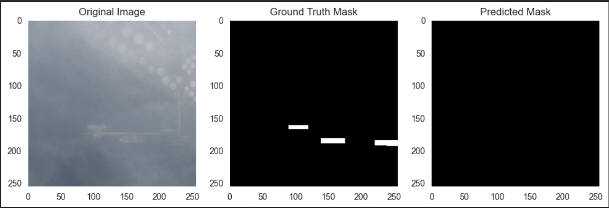

# Airbus Ship Detection

> **_NOTE:_**  Implemented model can be improved. Soon I will try possible ways to raise the efficiency of the U-net model.

## Introduction

Airbus Ship Detection Project is [Kaggle Competition](https://www.kaggle.com/competitions/airbus-ship-detection).
Its goal is to build a neural network model that can detect ships on images made from satellites. Many images do not contain ships,
and those that do may contain multiple ships. Ships within and across images may differ in size (sometimes significantly) and be located in open sea,
at docks, marinas, etc.

## Solution Description

### Exploratory Data Analysis

This step is crucial for familiarizing with data, how it's structured
what type of preprocessing needs to be done, etc. 

Overall, the dataset contains two folders `train_v2` and `test_v2`. The train folder contains 192556 images.
The test folder contains 15606 images. 
The main file of the dataset is `train_ship_segmentations_v2.csv`, which has two columns: Image Id and corresponding mask of ship encoded in run-length encoding format.

Dataset size: 231723.

Unique number of images: 192556.

There are 81723 masks in 42556 images.

There are 150000 empty images in 192556 unique images.

From these statistics, it's already noticeable that this dataset is unbalanced,
and it can be proved by plotting A chart depicting the number of images relative to the
number of ships in the images.


The dataset needs to be undersampled. I tried using two techniques: 
* First approach
```angular2html
# This is the first option for undersampling
# Separate the dataset into images with ships and images without ships
images_with_ships = unique_img_ids[unique_img_ids['has_ship'] == 1]
images_without_ships = unique_img_ids[unique_img_ids['has_ship'] == 0]

# Undersample the images without ships to achieve a balanced dataset
undersampled_images_without_ships = resample(images_without_ships,
                                            replace=False,  # Set to True if you want to allow duplicates
                                            n_samples=len(images_with_ships),
                                            random_state=42)  # Set a random seed for reproducibility
# Combine the undersampled images without ships with the images containing ships
undersampled_df = pd.concat([images_with_ships, undersampled_images_without_ships])

# Shuffle the dataframe to ensure randomness
balanced_train_df = undersampled_df.sample(frac=1, random_state=42).reset_index(drop=True)
```

* Second approach. I used this in learning the current model because it results in a smaller dataset
```angular2html
# This is the second option of undersampling
SAMPLES_PER_GROUP = 2000
balanced_train_df = unique_img_ids.groupby('ships').apply(lambda x: x.sample(SAMPLES_PER_GROUP) if len(x) > SAMPLES_PER_GROUP else x)
balanced_train_df['ships'].hist(bins=balanced_train_df['ships'].max()+1)
print(balanced_train_df.shape[0], 'masks')
```

Then, I used `sklearn.model_selection.train_test_split` to create testing and validation datasets.

The image below shows what input images, and output images(target masks) look like.


## Model Training

To create masks from images with ships I chose U-net structure, which is a well-known model architecture for Image Segmentation tasks.
I didn't know much about Image Segmentation before, because I didn't read articles about such models, so this project gave me an opportunity to improve my knowledge.

The image below depicts the simplified architecture of the U-net model.


I discovered that images have only two "classes": pixels that correspond to ships and background pixels (So, it makes the problem binary image segmentation).
I found on the [site](https://dev.to/_aadidev/3-common-loss-functions-for-image-segmentation-545o) that the most common losses for training Semantic Segmentation model are Dice Loss, Cross-entropy, and Shape-aware loss.
Moreover, when I tried learning U-net I found out that most of the labels in the image correspond to the background, so its images have an unbalanced number of pixels for each class and binary_crossentropy would be not relevant in my opinion. And this case led me to find another loss named BinaryFocalCrossEntropy that [helps to down-weight easy examples and focus more on hard examples](https://www.tensorflow.org/api_docs/python/tf/keras/losses/BinaryFocalCrossentropy#:~:text=According%20to%20Lin%20et%20al.%2C%202018%2C%20it%20helps%20to%20apply%20a%20%22focal%20factor%22%20to%20down%2Dweight%20easy%20examples%20and%20focus%20more%20on%20hard%20examples.%20By%20default%2C%20the%20focal%20tensor%20is%20computed%20as%20follows%3A).
So, I used this loss and got a decent [dice coefficient](https://oecd.ai/en/catalogue/metrics/average-dice-coefficient) for the base model(In my opinion). I also tried to use dice loss, which is `dice_loss=1-dice_coeff`, but didn't get any improvements. 

To augment data I created Sequential model that consists only from keras augmentation layers, such as RandomFlip, RandomZoom, etc. And mapped tensorflow.data.Dataset created by generator using `map` function.
To prevent unnecessary learning, I used Early Stopping Callback with patience 10. It monitored validation loss.

It stopped learning on the 44th epoch and restored the best weights, which was on the 34th epoch.


## Results
To create the necessary results, I need to mention that it's not enough just to write `model.predict(test_images)`.
Because such predictions contain probabilities that pixels correspond to ship-label or background-label, they need to be converted into form `1` (ship) or `0` (background).
To do so, we need to consider a new variable named threshold. The most obvious threshold value is 0.5 because images have two classes.


In the image below, some ships aren't seen

In the image below, none of the ships are seen. I think it's because of the fog, therefore, the image is noisy.


In the image below, I tried to use a threshold slightly lower than 0.5. I assume that the threshold value is a hyperparameter such as in logistic regression, and because most of the pixels in images correspond to the background, which the model can define more easily (probability is closer to 0), we can use a threshold lower than 0.5. In my opinion, the model with such a smaller threshold can find smaller ships and, therefore, highlights the surroundings of ships even if it's background.


The Overall dice coefficient on the validation dataset is 0.6942723989486694.